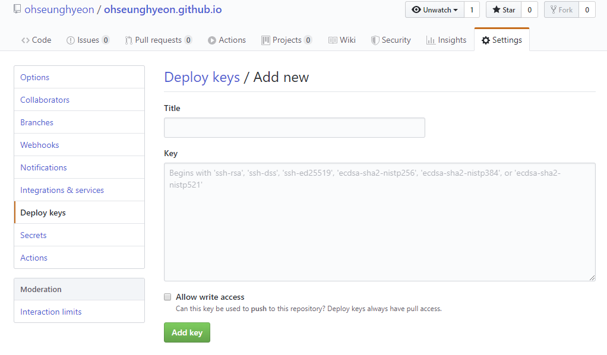
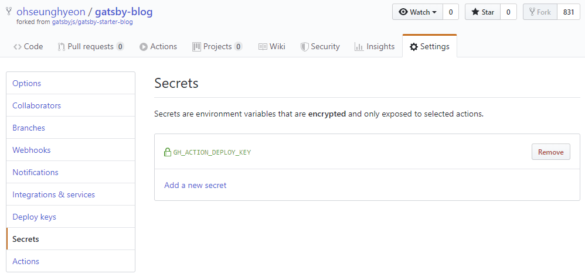

나는 Github pages를 운영하기 위해서 다음과 같이 두 개의 저장소를 사용하고 있다.

```
- username.github.io 저장소 (static files)
- 블로그 생성기 저장소 (gatsby - static site generater)
```

수동으로 블로그를 배포하기 위해서 블로그의 정적 파일들을 생성하고, 이를 **username.github.io** 저장소에 푸쉬해 왔다.  
이 과정을 어떻게 자동화 할 수 있을까 생각하다가 두 개 정도의 선택지로 추렸다.

1. [Netlify](https://www.netlify.com/) (또는 배포 자동화를 제공하는 서비스)
2. Github Actions

요즘 블로깅하시는 개발자 분들을 보면 Netlify라는 서비스를 많이 사용하고 있다. 단순한 호스팅 외에 많은 기능을 제공하는 서비스로 보인다.

이 서비스를 사용하면 **username.github.io** 같은 저장소를 사용하여 필요가 없다. 블로그의 호스팅을 github pages가 아닌 netlify로 할 수 있기 때문이다. 그래서 블로그 생성기 저장소에 push하고 netlify 서비스만 연동하면 알아서 정적 파일들을 생성하여 호스팅까지 해줄 수 있다.

그러나 Github Actions를 배우고 싶어, Github Actions로 배포하겠다.

### Github Actions


Github Actions는 2018년에 발표됐고, 현재는 beta 버전이다. 사용하기 위해서는 따로 [등록](https://github.com/features/actions)이 필요하며, 2019년 11월 13일부터 공개 버전으로 기본적인 기능으로 사용할 수 있다.

`youtube:https://www.youtube.com/embed/E1OunoCyuhY`

Github Actions는 깃헙 저장소의 push, pull request 등 미리 정의된 이벤트에 의해 사용자가 원하는 행동을 취할 수 있다. 이미 존재하는 다른 CI/CD 도구들처럼 빌드, 테스트, 배포 등을 할 수 있다.

또한 누군가 이슈를 올렸을 때 특정한 로직을 실행(이슈에 올라온 코드를 자동으로 실행하여 에러를 발견하는 등)할 수도 있고, pull request에 대해 PR 된 버전과 기존의 master 버전을 각각 배포한 url을 PR 쓰레드의 댓글로 달게 할 수도 있다.

## 어떻게 배포할까

앞서 말했듯이 내 경우는 **정적 사이트 생성기**와 **github pages** 저장소가 따로 존재한다. (한 저장소에 다른 브랜치로 두면 과정이 더 편했을 것을)

Gatsby 공식 사이트의 문서에 [Github Pages 관련 배포에 대한 문서](https://www.gatsbyjs.org/docs/how-gatsby-works-with-github-pages/)가 있으나 이는 한 저장소 내에 정적 사이트 생성기와 정적 파일이 *브랜치*로 구분되어 있는 경우를 설명하는 것이기에 나의 경우와는 관련이 없다.

내 경우 배포 자동화의 과정은 다음과 같다.

1. 정적 사이트 생성기 저장소에서 push를 한다.
2. push된 정적 사이트 생성기 저장소에서 gatsby build 명령어로 정적 파일들을 생성한다. (`/public` 경로에 파일 생성됨)
3. 생성된 파일을 **username.github.io** 저장소에 붙여 넣는다.
4. **username.github.io** 저장소를 커밋해 푸쉬한다.

분명 간단한 과정이긴 한데, Github Actions에서 구현하려면 어떻게 하지?

## Github actions 톺아보기


위와 같이 깃허브 저장소에 가면 Actions 버튼이 있다.  
(Github Actions Beta를 신청하여 승인 이메일을 받은 경우에만 활성화된다.)

Actions 버튼을 누르면 Workflow 파일을 생성할 수 있는 페이지가 나온다. 해당 페이지에서 **Add a new workflow** 버튼을 눌러서 workflow 파일을 GUI 상에서 생성해도 되고, 직접 파일을 만들어도 된다. 나의 경우 직접 만들어서 진행하겠다.

### Workflow 생성하기

Workflow 파일은 저장소의 root에서 **.github/workflows** 디렉토리를 생성한 후 그 내부에 `.yml` 또는 `.yaml`로 생성한다. 내 경우 blog deploy를 위해 다음과 같이 만들겠다. yml 파일의 이름은 아무렇게나 해도 되는 것 같다.

```
/.github/workflows/continuous-deployment-workflow.yml
```

참고로 Github Actions가 나온 당시에는 HCL syntax라는 것을 사용했지만 2019년 9월 30일 이후로 deprecated 된다. 조금 오래된 자료를 찾아보면 yml이 아닌 특이한 syntax를 가진 workflow 또는 action 파일을 찾을 수 있는데 이는 모두 곧 쓸모 없어진다.

workflow 작성법을 알고 싶다면 [Configuring a workflow](https://help.github.com/en/articles/configuring-a-workflow)와 [Workflow syntax for Github Actions](https://help.github.com/en/articles/workflow-syntax-for-github-actions)를 참고하길 바란다.

yml에 대해 빠르게 알고 싶다면 [Learn YAML in five minutes!](https://www.codeproject.com/Articles/1214409/Learn-YAML-in-five-minutes)을 참고하라.

아래는 배포를 위해 만든 workflow 파일이다

```yml
name: Blog Deployment

on: [push]

jobs:
  build:
    name: build
    runs-on: ubuntu-latest
    steps:
    - name: clone gatsby-blog
      uses: actions/checkout@master
      with:
        path: 'static-site-generator'

    - name: git config
      env:
        USER_NAME: ${{ github.event.pusher.name }}
        USER_EMAIL: ${{ github.event.pusher.email }}
      run: |
        git config --global user.email "$USER_EMAIL"
        git config --global user.name "$USER_NAME"

    - name: make deploy keys
      env:
        GH_ACTION_DEPLOY_KEY: ${{ secrets.GH_ACTION_DEPLOY_KEY }}
      run: |
        mkdir -p ~/.ssh/
        echo "$GH_ACTION_DEPLOY_KEY" > ~/.ssh/id_rsa
        chmod 600 ~/.ssh/id_rsa
        ssh-keyscan github.com >> ~/.ssh/known_hosts

    - name: clone static_site_repo
      run: |
        cd ..
        git clone git@github.com:ohseunghyeon/ohseunghyeon.github.io.git static_site_repo


    - name: install dependencies & build
      run: |
        yarn
        yarn build

    - name: move build files to static files repo
      run: |
        rm -rf ../static_site_repo/*
        mv ./public/* ../static_site_repo

    - name: push changed files
      run: |
        cd ../static_site_repo
        git add .
        git commit -m "$(git -C ../static-site-generator/ log --format=%B -n 1)"
        git push origin master
```

### name, on, jobs

```yml
name: Blog Deployment

on: [push]

jobs: ...
```

- `name`: Workflow의 이름
- `on`: 여기에 기술된 이벤트에 의해 이 workflow가 작동한다. 특정 동작일 수도 있고, schedule이 될 수도 있다. 나의 경우 해당 브랜치에서 push가 발생할 때 이 workflow를 실행한다. 특정 브랜치, 특정 파일에 의한 trigger도 지정 가능하다. 자세한 내용은 [Event Trigger](https://help.github.com/en/articles/events-that-trigger-workflows)를 참고하라.
- `jobs`: job이란 workflow에서 실행할 작업의 단위이다.

### job

```yml
jobs:
  build:
    name: build
    runs-on: ubuntu-latest
    steps:
      ...
```

`jobs` 아래에 위치한 **build**는 job이다. 해당 job 엔 name, runs-on, steps가 있다.

- `name`: job의 이름. 생략 가능하다.
- `runs-on`: 해당 job을 실행할 가상 환경으로 ubuntu, linux, macOs 로 설정할 수 있다.
- `steps`: step은 Job이 실행되는 하나의 가상 환경에서 이루어질 일련의 작업이다. job이 추상적인 단위라면 step은 좀 더 실질적인 단위로, command나 action을 실행할 수 있다.

### step - name, run

```yml
steps:
- name: install dependencies & build
  run: |
    yarn
    yarn build
```

`name`과 `run`이 있다. name은 생략 가능하며 이 때 name은 알아서 정해진다. 그리고 run은 command를 실행한다. command는 다음과 같이 한 줄 또는 여러줄로 생성 가능하다.

```yml
# single line
steps:
- run: yarn

# multiple lines
- run: |
  yarn
  yarn build
  ...
```

### step - env

```yml
steps:
- name: git config
  env:
    USER_NAME: ${{ github.event.pusher.name }}
    USER_EMAIL: ${{ github.event.pusher.email }}
  run: |
    git config --global user.email "$USER_EMAIL"
    git config --global user.name "$USER_NAME"
```

`env`에는 다음과 같이 아무 값이나 넣어서 설정할 수 있다.

```yml
env:
  USER_NAME: 게으른 고영이
```

그런데 `${{ github.event.pusher.name }}`는 뭘까? 이건 context와 이를 사용하는 문법이다. 이 경우에는 github이라는 context 객체 아래에 있는 event.pusher.name를 환경변수 **USER_NAME**과 **USER_EMAIL**로 각각 설정하는 것이다.  

다음과 같이 step을 작성하면 github context에 어떤 값이 있는지 확인할 수 있다.

```yml
- name: Dump GitHub context
  env:
    GITHUB_CONTEXT: ${{ toJson(github) }}
  run: echo "$GITHUB_CONTEXT"
```

Context와 이를 사용하는 문법에 대한 문서는 [Contexts and expression syntax for GitHub Actions](https://help.github.com/en/articles/contexts-and-expression-syntax-for-github-actions)를 참조하라.

### step - uses

```yml
- name: clone gatsby-blog
  uses: actions/checkout@master
  with:
    path: 'static-site-generator'
```

- `uses`: Action을 사용한다는 뜻이다. 위에서 서술했듯 step은 command 또는 action을 사용할 수 있다. 위에 있는 action의 경우 [actions/checkout](https://github.com/actions/checkout) 저장소에 있다. 이렇게 action을 다른 저장소에서 가져와 사용하거나, workflow 파일이 존재하는 동일한 저장소에 만들어서 사용할 수도 있다.

  - `actions/checkout`: 이 액션은 workflow를 실행하는 저장소의 최신 내역을 받아온다. 찾아보면 이미 만들어진 다양한 action이 있다. node를 설치해주는 액션도 있고, python 설치하는 애도 있다. 조립하듯 필요한 걸 찾아서 써도 되고, 아니면 만들어도 되겠다.

- `with`: Action에게 넘겨주는 파라미터. path라는 파라미터에 'static-site-generator' 값을 넘겨주고 있다. actions/checkout 액션이 받을 수 있는 파라미터 값은 [여기](https://github.com/actions/checkout/blob/master/action.yml)에서 볼 수 있다. path는 'Optional path to check out source code' 이라고 되어 있는데, 내 경우 static-site-generator라는 디렉토리에 해당 저장소를 받겠다는 뜻이고, 설정하지 않을 경우 저장소 이름으로 디렉토리를 만들게 된다.

### Steps 설명

```yml
steps:
# 정적 생성기 저장소를 fetch한다.
- name: clone gatsby-blog
  uses: actions/checkout@master
  with:
    path: 'static-site-generator'

# git config로 이메일과 이름을 설정한다. 그 값들은 github context에서 가져온다.
- name: git config
  env:
    USER_NAME: ${{ github.event.pusher.name }}
    USER_EMAIL: ${{ github.event.pusher.email }}
  run: |
    git config --global user.email "$USER_EMAIL"
    git config --global user.name "$USER_NAME"

# ssh private 키를 job 가상환경에 설치한다.
# 정적 사이트 저장소 git을 clone하고 push하기 위해 필요하다
- name: make deploy keys
  env:
    GH_ACTION_DEPLOY_KEY: ${{ secrets.GH_ACTION_DEPLOY_KEY }}
  run: |
    mkdir -p ~/.ssh/
    echo "$GH_ACTION_DEPLOY_KEY" > ~/.ssh/id_rsa
    chmod 600 ~/.ssh/id_rsa
    ssh-keyscan github.com >> ~/.ssh/known_hosts

# 정적 사이트를 static_stie_repo라는 directory에 clone한다.
- name: clone static_site_repo
  run: |
    cd ..
    git clone git@github.com:ohseunghyeon/ohseunghyeon.github.io.git static_site_repo

# static-site-generator 디렉토리에서 yarn과 yarn build를 실행한다.
# 바로 위의 step에서 cd ..로 workding directory를 바꿨는데
# 각각의 step은 working directory가 초기화되어
# 이 step에서 pwd는 static-site-generator directory이다.
- name: install dependencies & build
  run: |
    yarn
    yarn build

# 빌드한 파일들을 정적 사이트 저장소 디렉토리로 옮긴다.
- name: move build files to static files repo
  run: |
    rm -rf ../static_site_repo/*
    mv ./public/* ../static_site_repo

# 정적 사이트 저장소를 커밋하고 푸쉬한다.
# 커밋 내용은 정적 사이트 생성기의 제일 최근 커밋 메시지
- name: push changed files
  run: |
    cd ../static_site_repo
    git add .
    git commit -m "$(git -C ../static-site-generator/ log --format=%B -n 1)"
    git push origin master
```

나는 git 인증을 위해서 ssh key를 설치하는 방법을 택했다. 그러나 이 key는 깃 계정 세팅에서 넣는 키가 아닌 한 프로젝트에만 적용되는 [deploy keys](https://developer.github.com/v3/guides/managing-deploy-keys/#deploy-keys)다. deploy keys를 설정하면 특정 프로젝트에 public key를 추가하며 접근 권한을 설정할 수 있다.

ssh key를 생성하는 법을 모른다면 [여기](https://help.github.com/en/articles/generating-a-new-ssh-key-and-adding-it-to-the-ssh-agent#generating-a-new-ssh-key)를 참고하거나, 다음 명령어를 치면 된다.

```shell
ssh-keygen -t rsa -b 4096 -C "your_email@example.com" -f ./ssh-key-name
```

Key가 준비되었다면 다음과 같이 저장소에 접근하기 위해 Deploy keys에 생성한 public key를 입력하고, 이 때 **Allow write access**를 꼭 체크해야 한다.



그리고 ssh private key를 받아오는 과정이 필요한데, 중간에 보면 `${{ secrets.GH_ACTION_DEPLOY_KEY }}` 라는 context가 보인다. secrets는 저장소의 settings에서 설정 가능한데, private key를 secret에 추가하여 리눅스 가상환경에 가져가 파일로 생성하는 것이다.



이렇게 키까지 모두 세팅하면 저장소를 push할 때마다 자동으로 배포가 실행된다.

### Github Actions 용어 정리

아래 용어들은 [About GitHub Actions](https://help.github.com/en/articles/about-github-actions#workflow)의 번역본입니다.

<details>
<summary>여기를 눌러서 보기</summary>

#### Workflow

설정 가능한 자동화된 프로세스. 깃허브에 있는 프로젝트를 빌드, 테스트, 패키지, 릴리즈, 배포를 하기 위해서 저장소 내에 셋업할 수 있다. Workflow는 하나 이상의 job들로 이루어져 있으며, 스케쥴 또는 이벤트에 의해 활성화될 수 있다.

#### Workflow run

workflow의 인스턴스. 미리 설정된 이벤트가 발생했을 때 돌아간다. 매 workflow run에 대해 jobs, actions, logs, statuses를 확인할 수 있다.

#### Workflow file

YAML 파일. 하나 이상의 job을 포함한 workflow 설정 사항을 정의한다. 이 파일은 당신의 깃허브 저장소 최상단에서 `.github/workflows` 디렉토리 내에 존재한다.

#### Job

단계들로 정의된 하나의 작업. 매 작업은 새로 생성되는 가상 환경 인스턴스 내에서 동작한다. workflow file 내에서 job 들이 어떻게 돌아가야 하는지 설정하기 위해 의존성 규칙을 정의할 수 있다. job들을 나란히 돌릴 수도 있고, 이전 job의 상태를 봐가며 순차적으로 돌릴 수도 있다. 예를 들어 하나의 workflow에 **build**와 **test code**라는 두 개의 job이 있고, test job이 build job에 의존한다고 정의할 때, build job이 실패하면 test job은 돌아가지 않는다.

#### Step

step은 job에 의해 실행되는 task들의 집합이다. 각 스탭은 job이 실행되는 하나의 가상환경 안에서 action들이 filesystem을 사용하여 서로 정보를 교환할 수 있게 한다. step들은 command나 action을 실행할 수 있다.

#### Action

각각의 task들. 이를 결합하여 steps를 만들고 이는 곧 하나의 job이 된다. Action은 workflow에서 가장 작은 조립 블록이다. 당신의 actions를 만들 수 있고, 이 action을 깃허브 커뮤니티에 공유하거나, 다른 public action를 커스터마이즈 할 수도 있다. action을 workflow 내에서 사용하기 위해서는 반드시 action을 하나의 step으로써 포함해야 한다. (action === step 인가?)

#### Continuous integration (CI)

공유되는 저장소에 작은 코드를 빈번히 커밋할 때 사용되는 software 개발 방법. Github Actions를 가지고 빌드와 테스트를 자동화하기 위하여 당신만의 CI workflow를 생성할 수 있다. 저장소에서 workflow의 매 action 의 코드의 변화와 상세한 로그를 확인할 수 있다. CI는 버그를 더 빠르게 찾거나 해결하기 위해, 코드 상의 변화에 대한 즉각적인 반응을 제공하여 개발자의 시간을 절약해준다.

#### Continuous deployment (CD)

CI 상에서 빌드하는 것. 새로운 코드가 커밋되어 CI 테스트를 통과할 때, 그 코드는 자동으로 production에 배포된다. Github Actions를 가지고 당신만의 CD workflow를 만들 수 있으며, 이를 통해 자동으로 당신의 코드를 클라우드나, self-hosted service나 플랫폼에 배포할 수 있다. CD는 개발 과정을 자동화하고 테스트되고 안정된 코드 변화를 더 빠르게 고객에게 배포하여 개발자의 시간을 절약해준다.

#### Virtual environment

Github은 Linux, maxOS, Windows 가상 환경을 제공하여, 당신의 workflow를 돌리게 한다.

#### Runner

각 가상 환경 내의 Github 서비스는 가능한 job을 기다린다. runner가 job을 고르면, job의 actions를 실행하고, 경과, 로그, 결과를 깃헙에게 보고한다. runners는 한 번에 하나의 job을 실행한다.

#### Event

workflow run을 유발하는 특정 동작. 예를 들어 누군가 저장소에 커밋을 푸쉬하거나 이슈 또는 풀리퀘스트가 생성되는 행위.  또한 repository dispatch webhook을 사용한 외부 이벤트 발생을 이벤트로 설정할 수 있다.

#### Artifact

빌드나 코드를 테스트할 때 생성되는 파일. 예를 들어, 바이너리나 패키지 파일, 테스트 결과, 스크린샷, 로그 파일 등이 이에 해당한다. workflow에서 생성된 artifact는 해당 workflow와 관련이 있고, 다른 job에 의해 사용되거나 배포될 수 있다.

</details>

## 참고 자료

- [Outsider - GitHub Actions 소개](https://blog.outsider.ne.kr/1412)
- [css tricks - Introducing GitHub Actions](https://css-tricks.com/introducing-github-actions/)
- [허원철의 개발 블로그 - GitHub Action을 활용한 GitHub Page 배포](https://heowc.dev/2019/02/03/deploy-gh-page-with-github-action/)
- [GitHub Actions v2: JS Actions](https://lannonbr.com/blog/2019-08-17-gh-actions-js-actions/)
